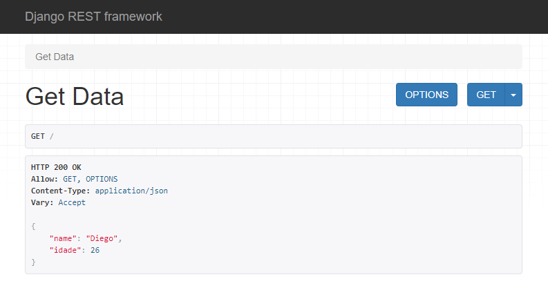

# API de Cadastro de Produtos no Varejo

API desenvolvida em Python com o framework Django. E uma simples API de listagem e criaçao mas exemplificam bem os conceitos de uma API.

## Logo

<div align="center">
  
</div>

## Sumário

- [Tecnologias Utilizadas](#tecnologias-utilizadas)
- [Status](#status)
- [Descrição](#descrição)
- [Funcionalidades](#funcionalidades)
- [Como Usar](#como-usar)
- [Estrutura do Projeto](#estrutura-do-projeto)
- [Autor](#autor)

## Tecnologias Utilizadas

<div style="display: flex; flex-direction: row;">
  <div style="margin-right: 20px; display: flex; justify-content: flex-start;">
    
  </div>
</div>

## Status


## Descrição

Este projeto consiste em uma API RESTful desenvolvida utilizando o framework Django e o Django Rest Framework.

Ele permite a busca e adição de dados relacionados a itens.

## Funcionalidades

- Recuperação de dados existentes na API
- Adição de novos itens à API

## Como Usar

1. Clone o repositório
2. Instale as dependências: `pip install -r requirements.txt`
3. Execute as migrações: `python manage.py makemigrations` e `python manage.py migrate`
4. Inicie o servidor: `python manage.py runserver`

## Estrutura do Projeto

A estrutura do projeto está organizada da seguinte forma:

```
DJANGO_REST_API/
├── api/
│   ├── __init__.py
│   ├── serializers.py
│   ├── urls.py
│   └── views.py
├── base/
│   ├── __init__.py
│   ├── admin.py
│   ├── apps.py
│   ├── migrations/
│   │   ├── __init__.py
│   │   └── 0001_initial.py
│   ├── models.py
│   └── tests.py
├── myproject/
│   ├── __init__.py
│   ├── asgi.py
│   ├── settings.py
│   ├── urls.py
│   └── wsgi.py
├── db.sqlite3
├── manage.py
├── req_test.py
└── README.md
```

### Explicação dos Arquivos e Diretórios

1. **`api/`**

   - Diretório responsável por definir a lógica da API.
   - **`serializers.py`**: Contém o serializador `ItemSerializer`, que converte os dados do modelo `Item` para JSON e vice-versa.
   - **`urls.py`**: Define os endpoints disponíveis na API e mapeia-os para as views correspondentes.
   - **`views.py`**: Contém as funções que manipulam as requisições HTTP (`GET`, `POST`, `PATCH`, `PUT`, `DELETE`) e retornam as respostas.

2. **`base/`**

   - Diretório que armazena o modelo de dados e outras funcionalidades relacionadas.
   - **`models.py`**: Define o modelo `Item`, que representa os produtos no depósito de varejo.
   - **`admin.py`**: (Opcional) Pode ser usado para registrar o modelo na interface administrativa do Django.
   - **`migrations/`**: Contém os arquivos de migração para aplicar mudanças no banco de dados.

3. **`myproject/`**

   - Diretório com as configurações principais do projeto Django.
   - **`settings.py`**: Configurações globais do projeto, como aplicativos instalados, banco de dados e middlewares.
   - **`urls.py`**: Arquivo principal de roteamento, que inclui as rotas definidas em `api/urls.py`.
   - **`wsgi.py`** e **`asgi.py`**: Pontos de entrada para servidores WSGI/ASGI.

4. **`db.sqlite3`**

   - Arquivo de banco de dados SQLite utilizado para armazenar os dados durante o desenvolvimento.

5. **`manage.py`**

   - Script de gerenciamento do Django, usado para rodar comandos como migrações, criação de superusuários e execução do servidor de desenvolvimento.

6. **`req_test.py`**

   - Script de testes que realiza chamadas para a API, como criar, listar, atualizar e deletar itens, para verificar o funcionamento da API.

7. **`README.md`**
   - Arquivo para documentação do projeto, que pode incluir instruções de instalação, descrição das funcionalidades, etc.

---

## Documentação da API

### Endpoints Disponíveis

#### 1. `GET http://127.0.0.1:8000/`

#### Resposta esperada:

```json
{
  "id": 1,
  "name": "Produto Teste",
  "price": "29.99",
  "description": "Um produto de teste para o sistema de depósito.",
  "category": "Eletrônicos",
  "stock": 100,
  "created": "2024-10-22T16:32:00.245504Z"
}
```

#### 2. `POST http://127.0.0.1:8000/add/`

#### Requisição:

```json
headers : {
  "Content-Type": "application/json"
}

body : {
  "name": "Novo Produto",
  "price": 19.99,
  "description": "Descrição do novo produto.",
  "category": "Alimentos",
  "stock": 50
}
```

#### Resposta esperada:

```json
{
  "id": 2,
  "name": "Novo Produto",
  "price": "19.99",
  "description": "Descrição do novo produto.",
  "category": "Alimentos",
  "stock": 50,
  "created": "2024-10-22T16:32:00.245504Z"
}
```

#### 3. `DELETE http://127.0.0.1:8000/delete/id/`

#### Resposta esperada:

```json
response : {
  "status": 204,
  "message": "Item deletado com sucesso."
}
```

#### 4. `PATCH http://127.0.0.1:8000/update/id/`

```json
headers : {
"Content-Type": "application/json"
}

body : {
"stock": 80
}
```

#### Resposta esperada:

```json
{
  "id": 2,
  "name": "Novo Produto",
  "price": "19.99",
  "description": "Descrição do novo produto.",
  "category": "Alimentos",
  "stock": 80,
  "created": "2024-10-22T16:32:00.245504Z"
}
```

#### 4. `PUT http://127.0.0.1:8000/update/id/`

```json
headers : {
  "Content-Type": "application/json"
}

body : {
  "name": "Produto Atualizado",
  "price": 29.99,
  "description": "Descrição atualizada do produto.",
  "category": "Eletrônicos",
  "stock": 100
}
```

#### Resposta esperada:

```json
{
  "id": 2,
  "name": "Produto Atualizado",
  "price": "29.99",
  "description": "Descrição atualizada do produto.",
  "category": "Eletrônicos",
  "stock": 100,
  "created": "2024-10-22T16:32:00.245504Z"
}
```

## Autor

Desenvolvido por Diego Franco.
